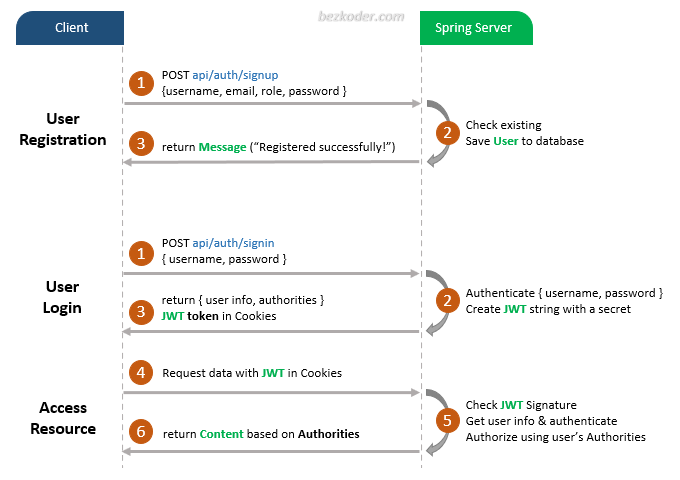

# Spring Boot Login example with Spring Security, MySQL and JWT

- Appropriate Flow for User Login and Registration with JWT
- Spring Boot Rest Api Architecture with Spring Security
- How to configure Spring Security to work with JWT
- How to define Data Models and association for Authentication and Authorization
- Way to use Spring Data JPA to interact with MySQL Database

## User Registration, Login and Authorization process.



## Spring Boot Server Architecture with Spring Security
You can have an overview of our Spring Boot Server with the diagram below:


For more detail, please visit:
> [Spring Boot Login example with MySQL and JWT](https://www.bezkoder.com/spring-boot-login-example-mysql/)

> [For H2 Embedded database](https://www.bezkoder.com/spring-boot-security-login-jwt/)

> [For MongoDB](https://www.bezkoder.com/spring-boot-jwt-auth-mongodb/)

## Dependency
– If you want to use PostgreSQL:
```xml
<dependency>
  <groupId>org.postgresql</groupId>
  <artifactId>postgresql</artifactId>
  <scope>runtime</scope>
</dependency>
```
– or MySQL:
```xml
<dependency>
  <groupId>mysql</groupId>
  <artifactId>mysql-connector-java</artifactId>
  <scope>runtime</scope>
</dependency>
```
## Configure Spring Datasource, JPA, App properties
Open `src/main/resources/application.properties`
- For PostgreSQL:
```
spring.datasource.url= jdbc:postgresql://localhost:5432/testdb
spring.datasource.username= postgres
spring.datasource.password= 123

spring.jpa.properties.hibernate.jdbc.lob.non_contextual_creation= true
spring.jpa.properties.hibernate.dialect= org.hibernate.dialect.PostgreSQLDialect

# Hibernate ddl auto (create, create-drop, validate, update)
spring.jpa.hibernate.ddl-auto= update

# App Properties
bezkoder.app.jwtSecret= bezKoderSecretKey
bezkoder.app.jwtExpirationMs= 86400000
```
- For MySQL
```
spring.datasource.url= jdbc:mysql://localhost:3306/testdb?useSSL=false
spring.datasource.username= root
spring.datasource.password= 123456

spring.jpa.properties.hibernate.dialect= org.hibernate.dialect.MySQL5InnoDBDialect
spring.jpa.hibernate.ddl-auto= update

# App Properties
bezkoder.app.jwtSecret= bezKoderSecretKey
bezkoder.app.jwtExpirationMs= 86400000
```
## Run Spring Boot application
```
mvn spring-boot:run
```

## Run following SQL insert statements
```
INSERT INTO roles(name) VALUES('ROLE_USER');
INSERT INTO roles(name) VALUES('ROLE_MODERATOR');
INSERT INTO roles(name) VALUES('ROLE_ADMIN');
```

## Refresh Token

[Spring Boot Refresh Token with JWT example](https://www.bezkoder.com/spring-boot-refresh-token-jwt/)

## Fullstack CRUD App

> [Vue.js + Spring Boot + H2 Embedded database example](https://www.bezkoder.com/spring-boot-vue-js-crud-example/)

> [Vue.js + Spring Boot + MySQL example](https://www.bezkoder.com/spring-boot-vue-js-mysql/)

> [Vue.js + Spring Boot + PostgreSQL example](https://www.bezkoder.com/spring-boot-vue-js-postgresql/)

> [Angular 8 + Spring Boot + Embedded database example](https://www.bezkoder.com/angular-spring-boot-crud/)

> [Angular 8 + Spring Boot + MySQL example](https://www.bezkoder.com/angular-spring-boot-crud/)

> [Angular 8 + Spring Boot + PostgreSQL example](https://www.bezkoder.com/angular-spring-boot-postgresql/)

> [Angular 10 + Spring Boot + MySQL example](https://www.bezkoder.com/angular-10-spring-boot-crud/)

> [Angular 10 + Spring Boot + PostgreSQL example](https://www.bezkoder.com/angular-10-spring-boot-postgresql/)

> [Angular 11 + Spring Boot + MySQL example](https://www.bezkoder.com/angular-11-spring-boot-crud/)

> [Angular 11 + Spring Boot + PostgreSQL example](https://www.bezkoder.com/angular-11-spring-boot-postgresql/)

> [Angular 12 + Spring Boot + Embedded database example](https://www.bezkoder.com/angular-12-spring-boot-crud/)

> [Angular 12 + Spring Boot + MySQL example](https://www.bezkoder.com/angular-12-spring-boot-mysql/)

> [Angular 12 + Spring Boot + PostgreSQL example](https://www.bezkoder.com/angular-12-spring-boot-postgresql/)

> [Angular 13 + Spring Boot + H2 Embedded Database example](https://www.bezkoder.com/spring-boot-angular-13-crud/)

> [Angular 13 + Spring Boot + MySQL example](https://www.bezkoder.com/spring-boot-angular-13-mysql/)

> [Angular 13 + Spring Boot + PostgreSQL example](https://www.bezkoder.com/spring-boot-angular-13-postgresql/)

> [React + Spring Boot + MySQL example](https://www.bezkoder.com/react-spring-boot-crud/)

> [React + Spring Boot + PostgreSQL example](https://www.bezkoder.com/spring-boot-react-postgresql/)

> [React + Spring Boot + MongoDB example](https://www.bezkoder.com/react-spring-boot-mongodb/)

Run both Back-end & Front-end in one place:
> [Integrate Angular with Spring Boot Rest API](https://www.bezkoder.com/integrate-angular-spring-boot/)

> [Integrate React.js with Spring Boot Rest API](https://www.bezkoder.com/integrate-reactjs-spring-boot/)

> [Integrate Vue.js with Spring Boot Rest API](https://www.bezkoder.com/integrate-vue-spring-boot/)

More Practice:
> [Spring Boot File upload example with Multipart File](https://www.bezkoder.com/spring-boot-file-upload/)

> [Exception handling: @RestControllerAdvice example in Spring Boot](https://www.bezkoder.com/spring-boot-restcontrolleradvice/)

> [Spring Boot Repository Unit Test with @DataJpaTest](https://www.bezkoder.com/spring-boot-unit-test-jpa-repo-datajpatest/)

Deployment:
> [Deploy Spring Boot App on AWS – Elastic Beanstalk](https://www.bezkoder.com/deploy-spring-boot-aws-eb/)

> [Docker Compose Spring Boot and MySQL example](https://www.bezkoder.com/docker-compose-spring-boot-mysql/)
